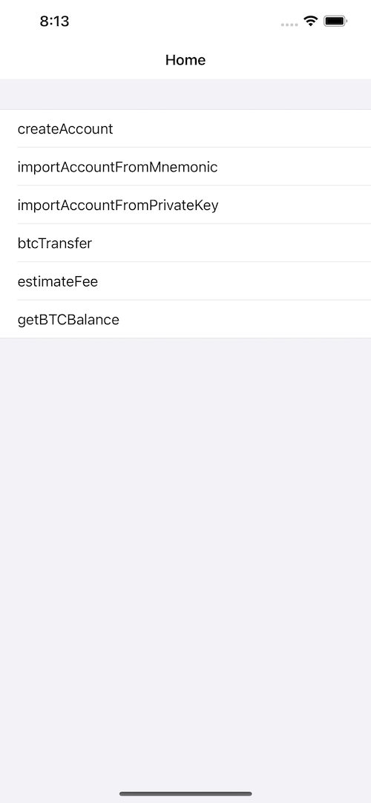

# BitcoinSwift
**BitcoinSwift** is an iOS toolbelt for interaction with the BTC network.


[](https://cocoapods.org/pods/BitcoinSwift)
[](https://www.swift.org/getting-started/#using-the-package-manager)



For more specific usage, please refer to the [demo](https://github.com/Marcos-cmyk/Bitcoin/tree/main/BitcoinDemo)

### Installation with CocoaPods
Add this to your [podfile](https://guides.cocoapods.org/using/getting-started.html) and run `pod install` to install:

```ruby
pod 'Bitcoin-alpha', '~> 1.0.0'
```
### Swift Package Manager
The Swift Package Manager  is a tool for automating the distribution of Swift code and is integrated into the swift compiler.

Once you have your Swift package set up, adding TronWeb as a dependency is as easy as adding it to the dependencies value of your Package.swift.
```ruby
dependencies: [
    .package(url: "https://github.com/Marcos-cmyk/Bitcoin.git", .upToNextMajor(from: "1.0.0"))
]
```

### Example usage 

```swift
import Bitcoin_alpha   
```

##### Setup Bitcoin
```swift
let bitcoin = Bitcoin_V1()
if bitcoin.isSuccess {
            //To do...
} else {
    bitcoin.setup(showLog: true) { [weak self] _ in
        guard let self = self else { return }
        //To do...
    }
}
```
##### Create Account
```swift
bitcoin.createAccount() { [weak self] state, address, privateKey, mnemonic,error in
    guard let self = self else { return }
    self.createAccountBtn.isEnabled = true
    tipLabel.text = "create finished."
    if state {
        let text =
            "address: " + address + "\n\n" +
            "mnemonic: " + mnemonic + "\n\n" +
            "privateKey: " + privateKey
        accountDetailTextView.text = text
    } else {
        accountDetailTextView.text = error
    }
}
```
##### Import Account From Mnemonic
```swift
guard let mnemonic = mnemonicTextView.text else{return}
bitcoin.importAccountFromMnemonic (mnemonic: mnemonic){ [weak self] state, address, privateKey, mnemonic, error in
    guard let self = self else { return }
    self.importAccountFromMnemonicBtn.isEnabled = true
    tipLabel.text = "import finished."
    if state {
        let text =
            "address: " + address + "\n\n" +
            "privateKey: " + privateKey + "\n\n" +
            "mnemonic: " + mnemonic
        walletDetailTextView.text = text
    } else {
        walletDetailTextView.text = error
    }
}
```

##### Import Account From PrivateKey
```swift
guard let privateKey = privateKeyTextView.text else{return}
bitcoin.importAccountFromPrivateKey(privateKey: privateKey){ [weak self] state, address, privateKey,error in
    guard let self = self else { return }
    self.importAccountFromPrivateKeyBtn.isEnabled = true
    tipLabel.text = "import finished."
    if state {
        let text =
            "address: " + address + "\n\n" +
            "privateKey: " + privateKey
        walletDetailTextView.text = text
    } else {
        walletDetailTextView.text = error
    }
}
```
##### Get Balance
```swift
bitcoin.getBTCBalance(address: address) { [weak self] state, balance,error in
    guard let self = self else { return }
    self.getBalanceBtn.isEnabled = true
    if state {
        let title = "BTC Balance: "
        self.balanceLabel.text = title + balance
    } else {
        self.balanceLabel.text = error
    }
}
```

##### Estimated BTC Transfer Fee
```swift
// If you have n input addresses and m output addresses, then your inputCount is n, and your outputCount is m.
let inputCount = 1
let outputCount = 2
bitcoin.estimateBtcTransferFee(inputsCount: inputCount,outputsCount: outputCount){ [weak self] state, high,medium,low,error in
    guard let self = self else { return }
    print("Estimate fee finised.")
    if (state) {
        let highFormatted = String(format: "%.2f", high)
        let mediumFormatted = String(format: "%.2f", medium)
        let lowFormatted = String(format: "%.2f", low)
        self.estimatedFeetLabel.text = "Send BTC hava three estimated fee. \n high:\(highFormatted) Satoshis. \n medium:\(mediumFormatted) Satoshis. \n low:\(lowFormatted) Satoshis"
    } else {
        self.estimatedFeetLabel.text = error
    }
}
```

##### BTC Transfer
```swift
// Support a Bitcoin address sending to multiple Bitcoin addresses simultaneously.
guard let privateKey = privateKeyTextView.text,
      let reviceAddress1 = reviceAddressField.text,
      let amount1 = amountTextField.text else { return }
var outputs = [[String: String]]()
let output1: [String: String] = ["address":reviceAddress1,"amount":amount1]
let output2: [String: String] = ["address":"address2","amount":"0.00001"]
outputs.append(output1)
outputs.append(output2)
let fee = 3000.0
bitcoin.transfer(privateKey: privateKey, outputs: outputs, fee: fee){ [weak self] state, hash,error in
    guard let self = self else { return }
    print("state = \(state)")
    print("hash = \(hash)")
    if (state) {
        self.hashLabel.text = hash
    } else {
        self.hashLabel.text = error
    }
}
```
For more specific usage, please refer to the [demo](https://github.com/Marcos-cmyk/Bitcoin/tree/main/BitcoinDemo)

## License

TronWeb is released under the MIT license. [See LICENSE](https://github.com/Marcos-cmyk/Bitcoin/blob/master/LICENSE) for details.
