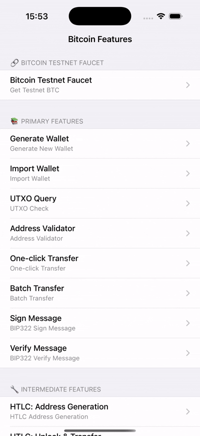

# Bitcoin_alpha
**Bitcoin_alpha** is an iOS toolbelt for interaction with the BTC network.


[](https://www.swift.org/getting-started/#using-the-package-manager)



For more specific usage, please refer to the [demo](https://github.com/Marcos-cmyk/Bitcoin/tree/main/BitcoinDemo)


### Swift Package Manager
The Swift Package Manager  is a tool for automating the distribution of Swift code and is integrated into the swift compiler.

```ruby
dependencies: [
    .package(url: "xxxxx", .upToNextMajor(from: ""))
]
```

### Example usage 

```swift
import Bitcoin_alpha   
```
# Bitcoin_V1 API Usage Examples

This document provides code examples for all async/await methods in the `Bitcoin_V1` class. All methods require iOS 13.0+ and use Swift's modern concurrency features.

## Table of Contents

1. [Wallet Management](#wallet-management)
2. [Address Operations](#address-operations)
3. [Transaction Operations](#transaction-operations)
4. [Fee Estimation](#fee-estimation)
5. [HTLC Operations](#htlc-operations)
6. [No-Signature Script Operations](#no-signature-script-operations)
7. [Multisig Operations](#multisig-operations)
8. [Message Signing & Verification](#message-signing--verification)

---

## Wallet Management

### 1. createAccount

Creates a new Bitcoin wallet account with a randomly generated mnemonic.

**Method Signature:**
```swift
@available(iOS 13.0, *)
public func createAccount(
    mnemonicLength: Int = 128, 
    isTestnet: Bool = true, 
    language: String = "english"
) async -> (Bool, BitcoinWallet_V1?, String?)
```

**Parameters:**
- `mnemonicLength`: Mnemonic length in bits (128/160/192/224/256, default: 128)
- `isTestnet`: Whether to use testnet (default: true)
- `language`: Mnemonic language (default: "english")

**Returns:**
- `success`: Whether the operation succeeded
- `wallet`: Wallet information (non-nil on success)
- `error`: Error message (nil on success)

**Example:**
```swift
let bitcoin = Bitcoin_V1()

// Ensure Bitcoin is initialized
if !bitcoin.isSuccess {
    await withCheckedContinuation { continuation in
        bitcoin.setup(showLog: true) { _ in
            continuation.resume()
        }
    }
}

// Create wallet with 12-word mnemonic (128 bits)
Task {
    let (success, wallet, error) = await bitcoin.createAccount(
        mnemonicLength: 128,
        isTestnet: true,
        language: ""
    )
    
    if success, let wallet = wallet {
        print("Mnemonic: \(wallet.mnemonic ?? "N/A")")
        print("Private Key: \(wallet.privateKey)")
        print("Public Key: \(wallet.publicKey)")
        print("Legacy Address: \(wallet.addresses.legacy)")
        print("Segwit Address: \(wallet.addresses.segwit)")
        print("Taproot Address: \(wallet.addresses.taproot)")
    } else {
        print("Error: \(error ?? "Unknown error")")
    }
}
```

---

### 2. importAccountFromMnemonic

Imports a wallet account from a mnemonic phrase.

**Method Signature:**
```swift
@available(iOS 13.0, *)
public func importAccountFromMnemonic(
    mnemonic: String, 
    isTestnet: Bool = true, 
    language: String? = nil
) async -> (Bool, BitcoinWallet_V1?, String?)
```

**Parameters:**
- `mnemonic`: Mnemonic string (12 or 24 words, space-separated)
- `isTestnet`: Whether to use testnet (default: true)
- `language`: Mnemonic language (optional)

**Returns:**
- `success`: Whether the operation succeeded
- `wallet`: Wallet information (non-nil on success)
- `error`: Error message (nil on success)

**Example:**
```swift
let bitcoin = Bitcoin_V1()

// Ensure Bitcoin is initialized
if !bitcoin.isSuccess {
    await withCheckedContinuation { continuation in
        bitcoin.setup(showLog: true) { _ in
            continuation.resume()
        }
    }
}

// Import wallet from mnemonic
let mnemonic = ""

Task {
    let (success, wallet, error) = await bitcoin.importAccountFromMnemonic(
        mnemonic: mnemonic,
        isTestnet: true,
        language: ""
    )
    
    if success, let wallet = wallet {
        print("Imported wallet successfully")
        print("Private Key: \(wallet.privateKey)")
        print("Segwit Address: \(wallet.addresses.segwit)")
    } else {
        print("Import failed: \(error ?? "Unknown error")")
    }
}
```

---

### 3. importAccountFromPrivateKey

Imports a wallet account from a private key.

**Method Signature:**
```swift
@available(iOS 13.0, *)
public func importAccountFromPrivateKey(
    privateKey: String, 
    isTestnet: Bool = true
) async -> (Bool, BitcoinWallet_V1?, String?)
```

**Parameters:**
- `privateKey`: Private key in hexadecimal format (64 characters)
- `isTestnet`: Whether to use testnet (default: true)

**Returns:**
- `success`: Whether the operation succeeded
- `wallet`: Wallet information (non-nil on success)
- `error`: Error message (nil on success)

**Example:**
```swift
let bitcoin = Bitcoin_V1()

// Ensure Bitcoin is initialized
if !bitcoin.isSuccess {
    await withCheckedContinuation { continuation in
        bitcoin.setup(showLog: true) { _ in
            continuation.resume()
        }
    }
}

// Import wallet from private key
let privateKey = ""

Task {
    let (success, wallet, error) = await bitcoin.importAccountFromPrivateKey(
        privateKey: privateKey,
        isTestnet: true
    )
    
    if success, let wallet = wallet {
        print("Imported wallet successfully")
        print("Public Key: \(wallet.publicKey)")
        print("Legacy Address: \(wallet.addresses.legacy)")
        print("Segwit Address: \(wallet.addresses.segwit)")
        print("Taproot Address: \(wallet.addresses.taproot)")
    } else {
        print("Import failed: \(error ?? "Unknown error")")
    }
}
```

---

## Address Operations

### 4. queryUTXO

Queries the UTXO (Unspent Transaction Output) list for a Bitcoin address.

**Method Signature:**
```swift
@available(iOS 13.0, *)
public func queryUTXO(
    address: String, 
    isTestnet: Bool = true
) async -> (Bool, [[String: Any]]?, String?)
```

**Parameters:**
- `address`: Bitcoin address string
- `isTestnet`: Whether to use testnet (default: true)

**Returns:**
- `success`: Whether the operation succeeded
- `utxos`: Array of UTXO dictionaries, each containing:
    - `txHash`: Transaction hash (String)
    - `index`: Output index (Int)
    - `value`: Value in satoshis (Int64)
- `error`: Error message (nil on success)

**Example:**
```swift
let bitcoin = Bitcoin_V1()

// Ensure Bitcoin is initialized
if !bitcoin.isSuccess {
    await withCheckedContinuation { continuation in
        bitcoin.setup(showLog: true) { _ in
            continuation.resume()
        }
    }
}

// Query UTXO for an address
let address = ""

Task {
    let (success, utxos, error) = await bitcoin.queryUTXO(
        address: address,
        isTestnet: true
    )
    
    if success, let utxos = utxos {
        var totalBalance: Int64 = 0
        for utxo in utxos {
            if let txHash = utxo["txHash"] as? String,
               let index = utxo["index"] as? Int,
               let value = utxo["value"] as? Int64 {
                print("UTXO: \(txHash):\(index) = \(value) sats")
                totalBalance += value
            }
        }
        print("Total Balance: \(totalBalance) sats (\(Double(totalBalance) / 100_000_000.0) BTC)")
    } else {
        print("Query failed: \(error ?? "Unknown error")")
    }
}
```

---

### 5. validateAddress

Validates a Bitcoin address and returns detailed information about it.

**Method Signature:**
```swift
@available(iOS 13.0, *)
public func validateAddress(
    address: String
) async -> (Bool, AddressValidationResult_V1?, String?)
```

**Parameters:**
- `address`: Bitcoin address string to validate

**Returns:**
- `success`: Whether the operation succeeded
- `result`: Validation result containing:
    - `isValid`: Whether the address is valid
    - `type`: Address type ("legacy", "segwit", "taproot")
    - `network`: Network type ("mainnet" or "testnet")
- `error`: Error message (nil on success)

**Example:**
```swift
let bitcoin = Bitcoin_V1()

// Ensure Bitcoin is initialized
if !bitcoin.isSuccess {
    await withCheckedContinuation { continuation in
        bitcoin.setup(showLog: true) { _ in
            continuation.resume()
        }
    }
}

// Validate an address
let address = ""

Task {
    let (success, result, error) = await bitcoin.validateAddress(address: address)
    
    if success, let result = result {
        if result.isValid {
            print("Address is valid")
            print("Type: \(result.type)")
            print("Network: \(result.network)")
        } else {
            print("Address is invalid")
        }
    } else {
        print("Validation failed: \(error ?? "Unknown error")")
    }
}
```

---

## Transaction Operations

### 6. oneClickTransfer

Performs a one-click transfer (automatically queries UTXO, signs, and broadcasts).

**Method Signature:**
```swift
@available(iOS 13.0, *)
public func oneClickTransfer(
    privKeyHex: String, 
    toAddress: String, 
    amountSats: Int64, 
    feeSats: Int64, 
    isTestnet: Bool = true, 
    fromAddress: String? = nil
) async -> (Bool, OneClickTransferResult_V1?, String?)
```

**Parameters:**
- `privKeyHex`: Private key in hexadecimal format
- `toAddress`: Recipient address
- `amountSats`: Transfer amount in satoshis
- `feeSats`: Fee in satoshis
- `isTestnet`: Whether to use testnet (default: true)
- `fromAddress`: Optional source address (if nil, automatically queries UTXO)

**Returns:**
- `success`: Whether the operation succeeded
- `result`: Transfer result containing:
    - `txid`: Transaction ID
- `error`: Error message (nil on success)

**Example:**
```swift
let bitcoin = Bitcoin_V1()

// Ensure Bitcoin is initialized
if !bitcoin.isSuccess {
    await withCheckedContinuation { continuation in
        bitcoin.setup(showLog: true) { _ in
            continuation.resume()
        }
    }
}

// Perform one-click transfer
let privateKey = ""
let recipientAddress = ""
let amountSats: Int64 = 1
let feeSats: Int64 = 1

Task {
    let (success, result, error) = await bitcoin.oneClickTransfer(
        privKeyHex: privateKey,
        toAddress: recipientAddress,
        amountSats: amountSats,
        feeSats: feeSats,
        isTestnet: true,
        fromAddress: nil  // Auto-query UTXO
    )
    
    if success, let result = result {
        print("Transfer successful!")
        print("Transaction ID: \(result.txid)")
    } else {
        print("Transfer failed: \(error ?? "Unknown error")")
    }
}
```

---

### 7. batchTransfer

Performs a batch transfer to multiple recipients in a single transaction.

**Method Signature:**
```swift
@available(iOS 13.0, *)
public func batchTransfer(
    outputs: [[String: Any]], 
    feeSats: Int64, 
    privKeyHex: String, 
    isTestnet: Bool, 
    fromAddress: String?
) async -> (Bool, BatchTransferResult_V1?, String?)
```

**Parameters:**
- `outputs`: Array of output dictionaries, each containing:
    - `address`: Recipient address (String)
    - `amount`: Amount in satoshis (Int64)
- `feeSats`: Fee in satoshis
- `privKeyHex`: Private key in hexadecimal format
- `isTestnet`: Whether to use testnet
- `fromAddress`: Optional source address

**Returns:**
- `success`: Whether the operation succeeded
- `result`: Transfer result containing:
    - `txid`: Transaction ID
- `error`: Error message (nil on success)

**Example:**
```swift
let bitcoin = Bitcoin_V1()

// Ensure Bitcoin is initialized
if !bitcoin.isSuccess {
    await withCheckedContinuation { continuation in
        bitcoin.setup(showLog: true) { _ in
            continuation.resume()
        }
    }
}

// Prepare batch transfer outputs
let outputs: [[String: Any]] = [
    ["address": "", "amount": 1],
    ["address": "", "amount": 1],
    ["address": "", "amount": 1]
]

let privateKey = ""
let feeSats: Int64 = 1

Task {
    let (success, result, error) = await bitcoin.batchTransfer(
        outputs: outputs,
        feeSats: feeSats,
        privKeyHex: privateKey,
        isTestnet: true,
        fromAddress: nil
    )
    
    if success, let result = result {
        print("Batch transfer successful!")
        print("Transaction ID: \(result.txid)")
        print("Transferred to \(outputs.count) recipients")
    } else {
        print("Batch transfer failed: \(error ?? "Unknown error")")
    }
}
```

---

## Fee Estimation

### 8. estimateFee

Estimates transaction fees based on input/output counts and address type.

**Method Signature:**
```swift
@available(iOS 13.0, *)
public func estimateFee(
    inputsCount: Int = 1, 
    outputsCount: Int = 2, 
    isTestnet: Bool = true, 
    addressType: String = "segwit", 
    n: Int = 1, 
    m: Int = 1
) async -> (Bool, FeeEstimateResult_V1?, String?)
```

**Parameters:**
- `inputsCount`: Number of inputs (UTXO count), default: 1
- `outputsCount`: Number of outputs (recipient + change), default: 2
- `isTestnet`: Whether to use testnet, default: true
- `addressType`: Address type ("legacy", "segwit", "taproot", "multisig"), default: "segwit"
- `n`: Multisig threshold (for multisig only), default: 1
- `m`: Multisig total signers (for multisig only), default: 1

**Returns:**
- `success`: Whether the operation succeeded
- `result`: Fee estimate result containing:
    - `high`: High priority fee in satoshis
    - `medium`: Medium priority fee in satoshis
    - `low`: Low priority fee in satoshis
    - `size`: Estimated transaction size in vBytes
- `error`: Error message (nil on success)

**Example:**
```swift
let bitcoin = Bitcoin_V1()

// Ensure Bitcoin is initialized
if !bitcoin.isSuccess {
    await withCheckedContinuation { continuation in
        bitcoin.setup(showLog: true) { _ in
            continuation.resume()
        }
    }
}

// Estimate fee for a Segwit transaction
Task {
    let (success, result, error) = await bitcoin.estimateFee(
        inputsCount: 1,
        outputsCount: 1,
        isTestnet: true,
        addressType: ""
    )
    
    if success, let result = result {
        print("Fee Estimates:")
        print("High Priority: \(result.high) sats (\(Double(result.high) / 100_000_000.0) BTC)")
        print("Medium Priority: \(result.medium) sats (\(Double(result.medium) / 100_000_000.0) BTC)")
        print("Low Priority: \(result.low) sats (\(Double(result.low) / 100_000_000.0) BTC)")
        print("Estimated Size: \(result.size) vBytes")
    } else {
        print("Estimation failed: \(error ?? "Unknown error")")
    }
}

// Estimate fee for a Multisig transaction (2-of-3)
Task {
    let (success, result, error) = await bitcoin.estimateFee(
        inputsCount: 1,
        outputsCount: 1,
        isTestnet: true,
        addressType: "",
        n: 1,
        m: 1
    )
    
    if success, let result = result {
        print("Multisig Fee Estimates:")
        print("High: \(result.high) sats")
        print("Medium: \(result.medium) sats")
        print("Low: \(result.low) sats")
    }
}
```

---

## HTLC Operations

### 9. generateHtlcAddress

Generates an HTLC (Hash Time Lock Contract) address.

**Method Signature:**
```swift
@available(iOS 13.0, *)
public func generateHtlcAddress(
    pubkey: String, 
    lockHeight: Int, 
    secretHex: String, 
    isTestnet: Bool = true
) async -> (Bool, HTLCAddressResult_V1?, String?)
```

**Parameters:**
- `pubkey`: Public key in hexadecimal format (66-character compressed public key)
- `lockHeight`: Lock height (block height)
- `secretHex`: Secret preimage in hexadecimal format
- `isTestnet`: Whether to use testnet (default: true)

**Returns:**
- `success`: Whether the operation succeeded
- `result`: HTLC address result containing:
    - `address`: HTLC address (P2WSH)
    - `redeemScript`: Redeem script in hexadecimal format
- `error`: Error message (nil on success)

**Example:**
```swift
let bitcoin = Bitcoin_V1()

// Ensure Bitcoin is initialized
if !bitcoin.isSuccess {
    await withCheckedContinuation { continuation in
        bitcoin.setup(showLog: true) { _ in
            continuation.resume()
        }
    }
}

// Generate HTLC address
let pubkey = ""
let lockHeight = 1
let secretHex = ""

Task {
    let (success, result, error) = await bitcoin.generateHtlcAddress(
        pubkey: pubkey,
        lockHeight: lockHeight,
        secretHex: secretHex,
        isTestnet: true
    )
    
    if success, let result = result {
        print("HTLC Address: \(result.address)")
        print("Redeem Script: \(result.redeemScript)")
    } else {
        print("Generation failed: \(error ?? "Unknown error")")
    }
}
```

---

### 10. unlockHtlcAddress

Unlocks an HTLC address and transfers funds to a recipient address.

**Method Signature:**
```swift
@available(iOS 13.0, *)
public func unlockHtlcAddress(
    htlcAddress: String, 
    toAddress: String, 
    amountSats: Int64, 
    feeSats: Int64, 
    privKeyHex: String, 
    lockHeight: Int, 
    secretHex: String, 
    redeemScript: String, 
    isTestnet: Bool = true
) async -> (Bool, HTLCUnlockResult_V1?, String?)
```

**Parameters:**
- `htlcAddress`: HTLC source address (P2WSH)
- `toAddress`: Recipient address
- `amountSats`: Transfer amount in satoshis
- `feeSats`: Fee in satoshis
- `privKeyHex`: Private key in hexadecimal format
- `lockHeight`: Lock height (must match the lock height used in generation)
- `secretHex`: Secret preimage in hexadecimal format (must match the secret used in generation)
- `redeemScript`: Redeem script in hexadecimal format (from generation)
- `isTestnet`: Whether to use testnet (default: true)

**Returns:**
- `success`: Whether the operation succeeded
- `result`: Unlock result containing:
    - `txid`: Transaction ID
- `error`: Error message (nil on success)

**Example:**
```swift
let bitcoin = Bitcoin_V1()

// Ensure Bitcoin is initialized
if !bitcoin.isSuccess {
    await withCheckedContinuation { continuation in
        bitcoin.setup(showLog: true) { _ in
            continuation.resume()
        }
    }
}

// Unlock HTLC address
let htlcAddress = ""
let toAddress = ""
let amountSats: Int64 = 1
let feeSats: Int64 = 1
let privateKey = ""
let lockHeight = 1
let secretHex = ""
let redeemScript = ""

Task {
    let (success, result, error) = await bitcoin.unlockHtlcAddress(
        htlcAddress: htlcAddress,
        toAddress: toAddress,
        amountSats: amountSats,
        feeSats: feeSats,
        privKeyHex: privateKey,
        lockHeight: lockHeight,
        secretHex: secretHex,
        redeemScript: redeemScript,
        isTestnet: true
    )
    
    if success, let result = result {
        print("HTLC unlocked successfully!")
        print("Transaction ID: \(result.txid)")
    } else {
        print("Unlock failed: \(error ?? "Unknown error")")
    }
}
```

---

## No-Signature Script Operations

### 11. generateNoSigScriptAddress

Generates a no-signature script address (only requires preimage, no signature needed).

**Method Signature:**
```swift
@available(iOS 13.0, *)
public func generateNoSigScriptAddress(
    lockHeight: Int, 
    secretHex: String, 
    isTestnet: Bool = true
) async -> (Bool, HTLCAddressResult_V1?, String?)
```

**Parameters:**
- `lockHeight`: Lock height (block height)
- `secretHex`: Secret preimage in hexadecimal format
- `isTestnet`: Whether to use testnet (default: true)

**Returns:**
- `success`: Whether the operation succeeded
- `result`: Address result containing:
    - `address`: No-signature script address (P2WSH)
    - `redeemScript`: Redeem script in hexadecimal format
- `error`: Error message (nil on success)

**Example:**
```swift
let bitcoin = Bitcoin_V1()

// Ensure Bitcoin is initialized
if !bitcoin.isSuccess {
    await withCheckedContinuation { continuation in
        bitcoin.setup(showLog: true) { _ in
            continuation.resume()
        }
    }
}

// Generate no-signature script address
let lockHeight = 1
let secretHex = ""

Task {
    let (success, result, error) = await bitcoin.generateNoSigScriptAddress(
        lockHeight: lockHeight,
        secretHex: secretHex,
        isTestnet: true
    )
    
    if success, let result = result {
        print("No-Sig Script Address: \(result.address)")
        print("Redeem Script: \(result.redeemScript)")
    } else {
        print("Generation failed: \(error ?? "Unknown error")")
    }
}
```

---

### 12. unlockNoSigScriptAddress

Unlocks a no-signature script address and transfers funds (no private key signature required, only preimage).

**Method Signature:**
```swift
@available(iOS 13.0, *)
public func unlockNoSigScriptAddress(
    noSigAddress: String, 
    toAddress: String, 
    amountSats: Int64, 
    feeSats: Int64, 
    lockHeight: Int, 
    secretHex: String, 
    redeemScript: String, 
    isTestnet: Bool = true
) async -> (Bool, HTLCUnlockResult_V1?, String?)
```

**Parameters:**
- `noSigAddress`: No-signature script source address (P2WSH)
- `toAddress`: Recipient address
- `amountSats`: Transfer amount in satoshis
- `feeSats`: Fee in satoshis
- `lockHeight`: Lock height (must match the lock height used in generation)
- `secretHex`: Secret preimage in hexadecimal format (must match the secret used in generation)
- `redeemScript`: Redeem script in hexadecimal format (from generation)
- `isTestnet`: Whether to use testnet (default: true)

**Returns:**
- `success`: Whether the operation succeeded
- `result`: Unlock result containing:
    - `txid`: Transaction ID
- `error`: Error message (nil on success)

**Example:**
```swift
let bitcoin = Bitcoin_V1()

// Ensure Bitcoin is initialized
if !bitcoin.isSuccess {
    await withCheckedContinuation { continuation in
        bitcoin.setup(showLog: true) { _ in
            continuation.resume()
        }
    }
}

// Unlock no-signature script address
let noSigAddress = ""
let toAddress = ""
let amountSats: Int64 = 1
let feeSats: Int64 = 1
let lockHeight = 1
let secretHex = ""
let redeemScript = ""

Task {
    let (success, result, error) = await bitcoin.unlockNoSigScriptAddress(
        noSigAddress: noSigAddress,
        toAddress: toAddress,
        amountSats: amountSats,
        feeSats: feeSats,
        lockHeight: lockHeight,
        secretHex: secretHex,
        redeemScript: redeemScript,
        isTestnet: true
    )
    
    if success, let result = result {
        print("No-sig script unlocked successfully!")
        print("Transaction ID: \(result.txid)")
    } else {
        print("Unlock failed: \(error ?? "Unknown error")")
    }
}
```

---

## Multisig Operations

### 13. generateMultisigAddress

Generates a multisig address (N-of-M).

**Method Signature:**
```swift
@available(iOS 13.0, *)
public func generateMultisigAddress(
    threshold: Int, 
    pubkeys: [String], 
    isTestnet: Bool = true
) async -> (Bool, MultisigAddressResult_V1?, String?)
```

**Parameters:**
- `threshold`: Threshold (N in N-of-M, minimum number of signatures required)
- `pubkeys`: Array of public keys (M total, all public keys)
- `isTestnet`: Whether to use testnet (default: true)

**Returns:**
- `success`: Whether the operation succeeded
- `result`: Multisig address result containing:
    - `script`: Multisig script in hexadecimal format
    - `p2shAddress`: P2SH multisig address (Legacy)
    - `p2wshAddress`: P2WSH multisig address (Segwit)
    - `threshold`: Threshold value (N)
    - `totalSigners`: Total number of signers (M)
- `error`: Error message (nil on success)

**Example:**
```swift
let bitcoin = Bitcoin_V1()

// Ensure Bitcoin is initialized
if !bitcoin.isSuccess {
    await withCheckedContinuation { continuation in
        bitcoin.setup(showLog: true) { _ in
            continuation.resume()
        }
    }
}

// Generate 2-of-3 multisig address
let threshold = 1
let pubkeys = [
    "",
    "",
    ""
]

Task {
    let (success, result, error) = await bitcoin.generateMultisigAddress(
        threshold: threshold,
        pubkeys: pubkeys,
        isTestnet: true
    )
    
    if success, let result = result {
        print("Multisig Address Generated:")
        print("Mode: \(result.threshold)-of-\(result.totalSigners)")
        print("P2SH Address: \(result.p2shAddress)")
        print("P2WSH Address: \(result.p2wshAddress)")
        print("Script: \(result.script)")
    } else {
        print("Generation failed: \(error ?? "Unknown error")")
    }
}
```

---

### 14. sendMultisigTransaction

Executes a multisig transfer (creates, signs, and broadcasts transaction).

**Method Signature:**
```swift
@available(iOS 13.0, *)
public func sendMultisigTransaction(
    multisigAddress: String, 
    toAddress: String, 
    amountSats: Int64, 
    feeSats: Int64, 
    allPubkeys: [String], 
    signPrivKeys: [String], 
    isTestnet: Bool = true
) async -> (Bool, MultisigTransferResult_V1?, String?)
```

**Parameters:**
- `multisigAddress`: Multisig address
- `toAddress`: Recipient address
- `amountSats`: Transfer amount in satoshis
- `feeSats`: Fee in satoshis
- `allPubkeys`: All public keys (M total, must match the order used in generation)
- `signPrivKeys`: Private keys for signing (must meet threshold N, order must match corresponding pubkeys)
- `isTestnet`: Whether to use testnet (default: true)

**Returns:**
- `success`: Whether the operation succeeded
- `result`: Transfer result containing:
    - `txid`: Transaction ID
- `error`: Error message (nil on success)

**Example:**
```swift
let bitcoin = Bitcoin_V1()

// Ensure Bitcoin is initialized
if !bitcoin.isSuccess {
    await withCheckedContinuation { continuation in
        bitcoin.setup(showLog: true) { _ in
            continuation.resume()
        }
    }
}

// Send multisig transaction (2-of-3, need 2 signatures)
let multisigAddress = ""
let toAddress = ""
let amountSats: Int64 = 1
let feeSats: Int64 = 1

// All public keys (must match generation order)
let allPubkeys = [
    "",
    "",
    ""
]

// Private keys for signing (need at least 2 for 2-of-3)
let signPrivKeys = [
    "",
    ""
]

Task {
    let (success, result, error) = await bitcoin.sendMultisigTransaction(
        multisigAddress: multisigAddress,
        toAddress: toAddress,
        amountSats: amountSats,
        feeSats: feeSats,
        allPubkeys: allPubkeys,
        signPrivKeys: signPrivKeys,
        isTestnet: true
    )
    
    if success, let result = result {
        print("Multisig transaction sent successfully!")
        print("Transaction ID: \(result.txid)")
    } else {
        print("Transaction failed: \(error ?? "Unknown error")")
    }
}
```

---

## Message Signing & Verification

### 15. signMessage

Signs a message using BIP322 standard.

**Method Signature:**
```swift
@available(iOS 13.0, *)
public func signMessage(
    message: String, 
    privKeyHex: String?, 
    addressType: String, 
    isTestnet: Bool = true
) async -> (Bool, String?, String?, String?)
```

**Parameters:**
- `message`: Message to sign
- `privKeyHex`: Private key in hexadecimal format (optional, if nil uses previously generated wallet)
- `addressType`: Address type ("legacy", "segwit", "taproot")
- `isTestnet`: Whether to use testnet (default: true)

**Returns:**
- `success`: Whether the operation succeeded
- `address`: Address that signed the message
- `signature`: Signature in Base64 format
- `error`: Error message (nil on success)

**Example:**
```swift
let bitcoin = Bitcoin_V1()

// Ensure Bitcoin is initialized
if !bitcoin.isSuccess {
    await withCheckedContinuation { continuation in
        bitcoin.setup(showLog: true) { _ in
            continuation.resume()
        }
    }
}

// Sign a message
let message = ""
let privateKey = ""
let addressType = ""

Task {
    let (success, address, signature, error) = await bitcoin.signMessage(
        message: message,
        privKeyHex: privateKey,
        addressType: addressType,
        isTestnet: true
    )
    
    if success, let address = address, let signature = signature {
        print("Message signed successfully!")
        print("Address: \(address)")
        print("Signature: \(signature)")
    } else {
        print("Signing failed: \(error ?? "Unknown error")")
    }
}
```

---

### 16. verifyMessage

Verifies a message signature using BIP322 standard.

**Method Signature:**
```swift
@available(iOS 13.0, *)
public func verifyMessage(
    message: String, 
    signature: String, 
    address: String, 
    isTestnet: Bool = true
) async -> (Bool, Bool, String?)
```

**Parameters:**
- `message`: Original message
- `signature`: Signature in Base64 format
- `address`: Address that should have signed the message
- `isTestnet`: Whether to use testnet (default: true)

**Returns:**
- `success`: Whether the verification request succeeded
- `isValid`: Whether the signature is valid (only valid when success is true)
- `error`: Error message (nil on success)

**Example:**
```swift
let bitcoin = Bitcoin_V1()

// Ensure Bitcoin is initialized
if !bitcoin.isSuccess {
    await withCheckedContinuation { continuation in
        bitcoin.setup(showLog: true) { _ in
            continuation.resume()
        }
    }
}

// Verify a message signature
let message = ""
let signature = ""
let address = ""

Task {
    let (success, isValid, error) = await bitcoin.verifyMessage(
        message: message,
        signature: signature,
        address: address,
        isTestnet: true
    )
    
    if success {
        if isValid {
            print("✅ Signature is valid!")
            print("The message was indeed signed by the holder of \(address)")
        } else {
            print("❌ Signature is invalid!")
            print("The message may have been modified or the signature is incorrect")
        }
    } else {
        print("Verification failed: \(error ?? "Unknown error")")
    }
}
```

---

## Complete Example: Full Workflow

Here's a complete example showing a typical workflow:

```swift
import UIKit

class ExampleViewController: UIViewController {
    lazy var bitcoin: Bitcoin_V1 = {
        let btc = Bitcoin_V1()
        return btc
    }()
    
    override func viewDidLoad() {
        super.viewDidLoad()
        performBitcoinOperations()
    }
    
    func performBitcoinOperations() {
        Task {
            // 1. Initialize Bitcoin
            if !bitcoin.isSuccess {
                await withCheckedContinuation { continuation in
                    bitcoin.setup(showLog: true) { _ in
                        continuation.resume()
                    }
                }
            }
            
            // 2. Create a new wallet
            let (createSuccess, wallet, createError) = await bitcoin.createAccount(
                mnemonicLength: 1,
                isTestnet: true,
                language: ""
            )
            
            guard createSuccess, let wallet = wallet else {
                print("Failed to create wallet: \(createError ?? "Unknown error")")
                return
            }
            
            print("Wallet created: \(wallet.addresses.segwit)")
            
            // 3. Query UTXO
            let (querySuccess, utxos, queryError) = await bitcoin.queryUTXO(
                address: wallet.addresses.segwit,
                isTestnet: true
            )
            
            if querySuccess, let utxos = utxos {
                print("Found \(utxos.count) UTXOs")
            }
            
            // 4. Estimate fee
            let (feeSuccess, feeResult, feeError) = await bitcoin.estimateFee(
                inputsCount: 1,
                outputsCount: 1,
                isTestnet: true,
                addressType: ""
            )
            
            if feeSuccess, let feeResult = feeResult {
                print("Estimated fee: \(feeResult.medium) sats")
            }
            
            // 5. Sign a message
            let (signSuccess, signAddress, signature, signError) = await bitcoin.signMessage(
                message: "",
                privKeyHex: wallet.privateKey,
                addressType: "",
                isTestnet: true
            )
            
            if signSuccess, let signature = signature {
                print("Message signed: \(signature)")
                
                // 6. Verify the signature
                let (verifySuccess, isValid, verifyError) = await bitcoin.verifyMessage(
                    message: "",
                    signature: signature,
                    address: signAddress ?? "",
                    isTestnet: true
                )
                
                if verifySuccess && isValid {
                    print("✅ Signature verified successfully!")
                }
            }
        }
    }
}
```

---

## Error Handling Best Practices

Always handle errors properly in your async/await code:

```swift
Task {
    let (success, result, error) = await bitcoin.someMethod(...)
    
    if success {
        // Handle success case
        if let result = result {
            // Process result
        }
    } else {
        // Handle error case
        let errorMessage = error ?? "Unknown error"
        print("Operation failed: \(errorMessage)")
        
        // Show user-friendly error message
        await MainActor.run {
            // Update UI with error
        }
    }
}
```

---

## Notes

- All methods require iOS 13.0+ due to async/await support
- Always ensure `bitcoin.isSuccess` is `true` before calling methods, or handle initialization in your async function
- All UI updates should be performed on the main thread using `MainActor.run` or `@MainActor`
- Amounts are specified in satoshis (1 BTC = 100,000,000 satoshis)
- Private keys and public keys should be in hexadecimal format (64 and 66 characters respectively)
- All addresses should match the network type (testnet vs mainnet)


For more specific usage, please refer to the [demo](https://github.com/Marcos-cmyk/Bitcoin/tree/main/BitcoinDemo)

## License

Bitcoin_alpha is released under the MIT license. [See LICENSE](https://github.com/Marcos-cmyk/Bitcoin/blob/master/LICENSE) for details.
